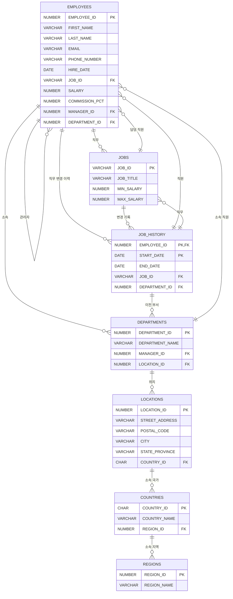

# **오라클 HR 스키마 상세 정보**

## **1. HR 스키마 개요**
HR(Human Resources) 스키마는 **직원(Employee) 및 부서(Department) 관련 데이터를 저장하는 샘플 데이터베이스**로, 오라클 데이터베이스 학습에 사용됩니다.

## **2. 테이블 목록 및 관계**
HR 스키마에는 총 **7개의 주요 테이블**이 있으며, 테이블 간 **외래 키(Foreign Key, FK)를 이용한 관계**가 존재합니다.

| 테이블명         | 설명 |
|-----------------|------|
| `EMPLOYEES`     | 직원 정보 저장 (사원 ID, 이름, 이메일, 급여 등) |
| `DEPARTMENTS`   | 부서 정보 저장 (부서 ID, 부서명, 부서 관리자) |
| `JOBS`          | 직무 정보 저장 (직무 ID, 직무명, 최소 및 최대 급여) |
| `JOB_HISTORY`   | 직원의 직무 변경 이력 저장 (사원 ID, 시작일, 종료일, 직무 ID, 부서 ID) |
| `LOCATIONS`     | 부서가 위치한 장소 정보 저장 (위치 ID, 도시, 국가 ID) |
| `COUNTRIES`     | 국가 정보 저장 (국가 ID, 국가명, 지역 ID) |
| `REGIONS`       | 대륙(지역) 정보 저장 (지역 ID, 지역명) |

---

## **3. HR 스키마 테이블 상세 구조**

### **3.1 EMPLOYEES 테이블 (직원 정보)**
- **직원(Employee)의 기본 정보를 저장하는 테이블**입니다.
- `EMPLOYEE_ID`(기본 키, PK)를 기준으로 **각 직원이 고유한 ID를 가짐**.
- `MANAGER_ID` 필드를 통해 **자기 참조(SELF JOIN) 관계를 가짐** (상사 정보).

#### **컬럼 정보**
| 컬럼명 | 데이터 타입 | 설명 |
|--------|------------|------|
| `EMPLOYEE_ID` | NUMBER(6) | 직원 ID (기본 키) |
| `FIRST_NAME` | VARCHAR2(20) | 직원 이름 (선택 사항) |
| `LAST_NAME` | VARCHAR2(25) | 직원 성 (필수) |
| `EMAIL` | VARCHAR2(25) | 이메일 (고유 값) |
| `PHONE_NUMBER` | VARCHAR2(20) | 전화번호 |
| `HIRE_DATE` | DATE | 입사일 |
| `JOB_ID` | VARCHAR2(10) | 직무 ID (외래 키) |
| `SALARY` | NUMBER(8,2) | 급여 |
| `COMMISSION_PCT` | NUMBER(2,2) | 커미션 비율 |
| `MANAGER_ID` | NUMBER(6) | 상사(매니저) ID (자기 참조) |
| `DEPARTMENT_ID` | NUMBER(4) | 부서 ID (외래 키) |

#### **관계**
- `EMPLOYEES.JOB_ID` → `JOBS.JOB_ID`
- `EMPLOYEES.MANAGER_ID` → `EMPLOYEES.EMPLOYEE_ID`
- `EMPLOYEES.DEPARTMENT_ID` → `DEPARTMENTS.DEPARTMENT_ID`

---

### **3.2 DEPARTMENTS 테이블 (부서 정보)**
- **각 부서(Department)의 정보**를 저장하는 테이블입니다.

#### **컬럼 정보**
| 컬럼명 | 데이터 타입 | 설명 |
|--------|------------|------|
| `DEPARTMENT_ID` | NUMBER(4) | 부서 ID (기본 키) |
| `DEPARTMENT_NAME` | VARCHAR2(30) | 부서명 (필수) |
| `MANAGER_ID` | NUMBER(6) | 부서 관리자 ID (EMPLOYEES 테이블 참조) |
| `LOCATION_ID` | NUMBER(4) | 부서 위치 ID (LOCATIONS 테이블 참조) |

#### **관계**
- `DEPARTMENTS.MANAGER_ID` → `EMPLOYEES.EMPLOYEE_ID`
- `DEPARTMENTS.LOCATION_ID` → `LOCATIONS.LOCATION_ID`

---

### **3.3 JOBS 테이블 (직무 정보)**
- **각 직무(Job)의 정보**를 저장하는 테이블입니다.

#### **컬럼 정보**
| 컬럼명 | 데이터 타입 | 설명 |
|--------|------------|------|
| `JOB_ID` | VARCHAR2(10) | 직무 ID (기본 키) |
| `JOB_TITLE` | VARCHAR2(35) | 직무명 |
| `MIN_SALARY` | NUMBER(6) | 최소 급여 |
| `MAX_SALARY` | NUMBER(6) | 최대 급여 |

---

### **3.4 JOB_HISTORY 테이블 (직무 변경 이력)**
- **직원이 과거에 수행했던 직무 및 부서 변경 이력**을 저장하는 테이블입니다.

#### **컬럼 정보**
| 컬럼명 | 데이터 타입 | 설명 |
|--------|------------|------|
| `EMPLOYEE_ID` | NUMBER(6) | 직원 ID (EMPLOYEES 테이블 참조) |
| `START_DATE` | DATE | 변경 시작일 |
| `END_DATE` | DATE | 변경 종료일 |
| `JOB_ID` | VARCHAR2(10) | 직무 ID (JOBS 테이블 참조) |
| `DEPARTMENT_ID` | NUMBER(4) | 부서 ID (DEPARTMENTS 테이블 참조) |

#### **관계**
- `JOB_HISTORY.EMPLOYEE_ID` → `EMPLOYEES.EMPLOYEE_ID`
- `JOB_HISTORY.JOB_ID` → `JOBS.JOB_ID`
- `JOB_HISTORY.DEPARTMENT_ID` → `DEPARTMENTS.DEPARTMENT_ID`

---

### **3.5 LOCATIONS 테이블 (위치 정보)**
- **부서의 위치(Location) 정보를 저장**하는 테이블입니다.

#### **컬럼 정보**
| 컬럼명 | 데이터 타입 | 설명 |
|--------|------------|------|
| `LOCATION_ID` | NUMBER(4) | 위치 ID (기본 키) |
| `STREET_ADDRESS` | VARCHAR2(40) | 거리 주소 |
| `POSTAL_CODE` | VARCHAR2(12) | 우편번호 |
| `CITY` | VARCHAR2(30) | 도시 |
| `STATE_PROVINCE` | VARCHAR2(25) | 주/도 |
| `COUNTRY_ID` | CHAR(2) | 국가 ID (COUNTRIES 테이블 참조) |

#### **관계**
- `LOCATIONS.COUNTRY_ID` → `COUNTRIES.COUNTRY_ID`

---

### **3.6 COUNTRIES 테이블 (국가 정보)**
- **국가(Country) 정보를 저장**하는 테이블입니다.

#### **컬럼 정보**
| 컬럼명 | 데이터 타입 | 설명 |
|--------|------------|------|
| `COUNTRY_ID` | CHAR(2) | 국가 ID (기본 키) |
| `COUNTRY_NAME` | VARCHAR2(40) | 국가명 |
| `REGION_ID` | NUMBER(4) | 지역 ID (REGIONS 테이블 참조) |

#### **관계**
- `COUNTRIES.REGION_ID` → `REGIONS.REGION_ID`

---

### **3.7 REGIONS 테이블 (대륙/지역 정보)**
- **국가를 포함하는 지역(대륙) 정보**를 저장하는 테이블입니다.

#### **컬럼 정보**
| 컬럼명 | 데이터 타입 | 설명 |
|--------|------------|------|
| `REGION_ID` | NUMBER(4) | 지역 ID (기본 키) |
| `REGION_NAME` | VARCHAR2(25) | 지역명 |

---

## **4. HR 스키마 테이블 관계 요약**
- **EMPLOYEES → JOBS (직무 관계)**
- **EMPLOYEES → DEPARTMENTS (부서 관계)**
- **DEPARTMENTS → LOCATIONS (위치 관계)**
- **LOCATIONS → COUNTRIES (국가 관계)**
- **COUNTRIES → REGIONS (대륙 관계)**

## HR 스키마 ER 다이어그램

