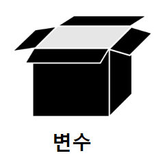
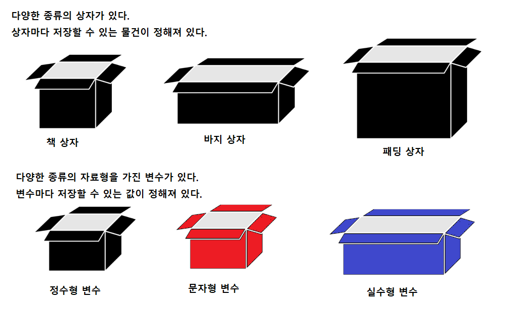
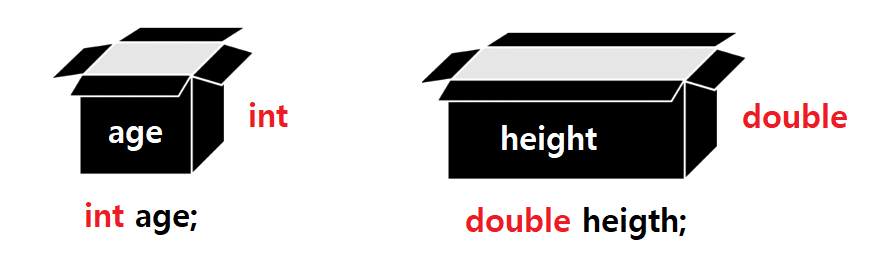
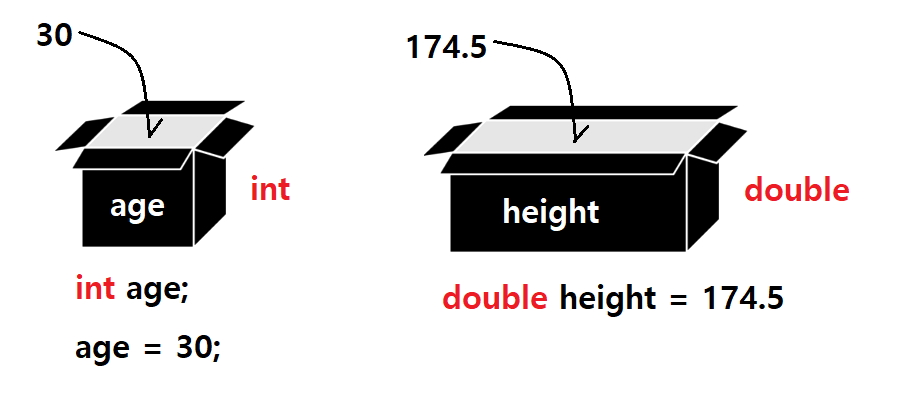

# 변수 (Variable)와 자료형

## 변수란?

- 변수는 **하나의 값을 저장할 수 있는 상자**다.
- 변수는 **데이터를 저장하기 위한 메모리 공간**이다. 
- 프로그램이 실행되는 동안 변수에 저장된 값은 **변할 수 있기 때문에 변수**라고 한다.



## 변수의 특징

- 변수(상자)는 값을 저장할 수 있다.
- 변수(상자)마다 고유한 이름을 가지고 있어서 구별할 수 있다.
- 변수(상자)는 다양한 형태와 크기가 존재하고, 그 형태와 크기에 따라서 담을 있는 값이 정해져 있다.

## 자료형이란?

- 자료형은 변수(상자)의 종류를 지정한다.
- 변수(상자)는 자료형(상자의 종류)에 맞는 값만 저장할 수 있다. 
- 변수(상자, 저장소)를 생성할 때는 반드시 자료형(상자의 종류)를 지정해야 한다.
- 변수(상자)를 생성할 때 지정된 자료형(상자의 종류)은 변경할 수 없다.



### 자바의 기본 자료형(Primitive Data Type)

- 자바는 다양한 자료형(데이터타입)을 제공한다.
- 변수(상자)를 생성할 때 아래의 자료형 중 하나를 지정해서 변수(상자)를 생성한다.

Type | Keyword | Size | Default value | Range
---- | ------- | ---- | ------------- | -----
논리형 | **boolean** | 1 bit | false | true, false
정수형 | byte | 1 byte | 0 | -128 ~ 127
정수형 | short | 2 byte | 0 | -32,768 ~ 32,767
정수형 | **int (기본)** | **4 byte** | 0 | -2,147,483,648 ~ 2,147,483,647
정수형 | long | 8 byte | 0L | -9,223,372,036,854,775,808 ~ 9,223,372,036,854,775,807
실수형 | float | 4 byte | 0.0F | 3.4 X 10<sup>−38</sup> ~ 3.4 X 10<sup>38</sup> 의 근사값
실수형 | **double (기본)** | **8 byte** | 0.0 | 1.7 X 10<sup>−308</sup> ~ 1.7 X 10<sup>308</sup> 의 근사값
문자형 | **char** | 2 byte (유니코드) | '\u0000' | 0 ~ 65,535


## 변수(상자)의 생성과 활용

### 변수의 생성
```java
자료형 변수명;

// 자료형은 상자의 종류다. 상자가 담을 수 있는 값을 종류를 결정한다.

// 변수명은 상자의 고유한 이름이다. 고유한 이름으로 다른 변수(상자)와 구별한다.
// 변수명은 그 변수에 저장되는 값을 잘 드러내는 이름으로 정한다.

// 나이를 저장하는 변수(상자) 만들기
int age;

// 키를 저장하는 변수(상자) 만들기
double height;
```


### 변수 생성 및 값 저장
```java
자료형 변수명;
변수명 = 값;

// 변수명 = 값;은 지정된 변수명과 일치하는 이름을 가진 상자에 값을 저장시킨다.
// 값을 저장하거나 값을 사용할 때는 항상 변수명(상자의 이름)을 이용한다.

// 나이를 저장하는 변수(상자)를 만들고 값 저장하기
int age;
age = 30;

// 키를 저장하는 변수(상자)를 만들고 값 저장하기
double height;
height = 175.4;
```


```java
자료형 변수명 = 값;

// 변수(상자)를 만들 때부터 값을 담아서 변수(상자)를 생성한다.
// 위와 같이 작성하면 지정된 값이 저장된 변수(상자)가 생성된다.

// 나이 30이 저장된 변수(상자) 만들기
int age = 30;

// 키 174.5가 저장된 변수(상자) 만들기
double height = 174.5;
```

### 변수에 값 저장하고 변경하기
```java
자료형 변수명 = 값1;
변수명 = 값2;

// 값1이 저장된 변수(상자)를 생성한다.
// 변수(상자)에 값2을 저장함, 상자에 저장된 값은 값1에서 값2로 변경되었다.

// 나이 30이 저장된 변수 생성하기, 변수에 저장된 값을 40으로 변경하기
int age = 30;
age = 40;   // 변수(상자)에 40이 저장된다. 변수에 저장된 값이 30에서 40으로 변했다.

// 키 174.5가 저장된 변수 생성하기, 변수에 저장된 값을 180.1로 변경하기
double height = 174.5;
height = 180.1;
```

