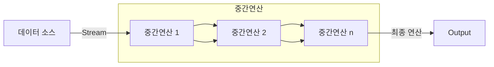

# Java Stream

- Stream은 **일련의 데이터 흐름**을 의미한다.
- Java의 Stream API는 **일련의 데이터의 흐름을 표준화된 방법으로 쉽게 처리할 수 있도록 지원하는 API**이다.
- Java의 Stream API를 이용하면 **일련의 데이터를 함수형 연산을 통해 표준화된 방법으로 쉽게 처리**할 수 있다.
- Java의 Stream API를 이용하면 **컬렉션(List, Set, Map 등) 또는 배열(Array) 등의 데이터 소스를 효율적으로 필터링, 변환, 집계 등의 연산을 수행**할 수 있다.

## Stream의 주요 특징
1. 데이터를 변경하지 않음(Immutable)
   - Stream은 원본 데이터를 변경하지 않고, 새로운 스트림을 생성하여 연산을 수행한다.
2. 내부 반복(Internal Iteration)
   - 기존의 for문을 사용한 외부 반복(External Iteration)과 달리 내부적으로 데이터를 처리한다.
3. 지연 연산(Lazy Evaluation)
   - 중간 연산(Intermediate Operation)은 최종 연산(Terminal Operation)이 실행되기 전까지 수행되지 않는다.
4. 병렬 처리(Parallel Processing)
   - 쉽게 병렬 스트림(Parallel Stream)으로 변환할 수 있어 대용량 데이터 처리 성능을 향상시킬 수 있다.

## Stream을 사용하는 이유
1. 가독성 향상
    - Stream을 사용하게 되면 코딩이 훨씬 간결해지고 명료해져서 소스코드의 가독성이 좋아진다.
  
    ```java
    // 반복문으로 처리하는 기존 방식
    List<String> names = Arrays.asList("김유신", "이순신", "강감찬", "이성계", "류관순", "이봉창");
    
    // 성씨가 "이"씨인 이름을 찾아서 정렬하여 출력하기
    List<String> filteredAndSortedNames = new ArrayList<String>();
    
    for (String name : names) {
        if (name.startsWith("이")) {
            filteredAndSortedNames.add(name);
        }
    }
    Collections.sort(filteredAndSortedNames);

    for (String name : filteredAndSortedNames) {
        System.out.println(name);
    }
    ```

    ```java
    // Java Stream API를 사용하는 방식
    List<String> names = Arrays.asList("김유신", "이순신", "강감찬", "이성계", "류관순", "이봉창");

    // 성씨가 "이"씨인 이름을 찾아서 정렬하여 출력하기
    names.stream()
         .filter(name -> name.startsWith("이"))
         .sorted()
         .forEach(System.out::println)
    ```
2. 유지보수성 향상
    - Java Stream를 사용하면 간결하고 명확한 코드로 데이터를 처리할 수 있어서 코드의 가독성과 유지보수성이 향상된다.
    - 코드에 주석을 달지 않아도 코드의 의도를 파악하기 쉬워지고, 변경이 필요한 부분을 쉽게 수정할 수 있다.
3. 병렬 처리 지원
    - 병렬 처리는 대용량 데이터를 효율적으로 처리하기 위해 필수적인 기능이며, Java Stream API는 간단하게 parallelStream()이라는 메소드를 호출하는 것만으로 병렬처리가 지원되는 Stream을 사용할 수 있다.

## Java Stream의 처리 구조와 처리 특징
Java Stream은  **생성 -> 가공 -> 소비**의 구조로 구성되어 있다.
- 데이터를 처리하기 위해서는, 데이터를 생성하고, 생성된 데이터를 가공하여 필요한 형태로 변환한 다음, 최종적으로 결과를 소비해야 한다.



1. Stream의 생성
   - 자바의 Stream API는 다양한 데이터 소스(콜렉션, 배열, 파일 등)로 스트림을 생성할 수 있다.
   - Stream API로 데이터를 데이터를 처리할 때 최초 1번 수행한다.
   - 생성 단계에서는 모든 데이터가 한꺼번에 메모리에 로드되지 않고 필요할 때만 로드된다
2. 중간 연산
    - 중간 연산은 데이터를 원하는 형태로 가공하는 중간처리를 의미한다.
    - 중간 연산에서는 필터링(filter), 변형(map), 정렬(sort) 등의 연산을 수행한다.
    - 중간 연산은 스트림을 반환함으로 **여러 개의 중간 연산을 연속해서 연결하여 체이닝(Chainig)이 가능**하다.
    - 기존 데이터를 변경하지 않고 새로운 스트림을 생성한다.
3. 최종 연산
    - 최종 연산은 스트림의 요소를 소모하여 결과를 생성하는 연산이다.
    - 최종 연산을 실행하면 스트림은 종료되고 재사용할 수 없다.
    - 따라서, 모든 데이터 처리 및 변환이 완료된 후 최종 연산을 수행한다.