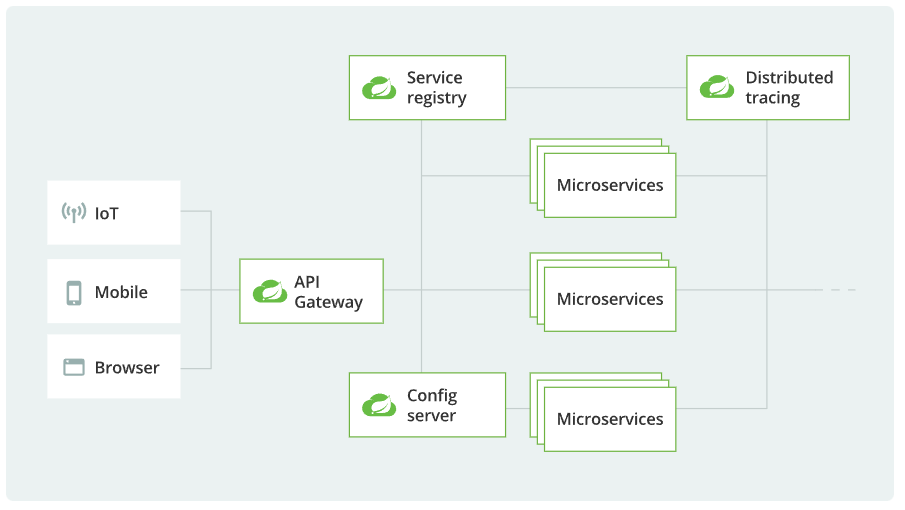

# 스프링 부트와 스프링 클라우드

마이크로서비스 아키텍처는 대규모 애플리케이션을 독립적인 작은 서비스들로 나누어 개발, 배포, 운영하는 방식이다.  
스프링 부트와 스프링 클라우드는 마이크로서비스 아키텍처 기반의 애플리케이션을 개발하는데 가장 많이 사용되는 기술이다.

- **스프링 부트**는 마이크로서비스의 개별 서비스를 개발하는 프레임워크다.
- **스프링 클라우드**는 마이크로서비스 간의 통신, 구성 관리, 로드 밸런싱, 서비스 디스커버리 등의 기능을 제공하는 프레임워크다.
- **마이크로서비스 아키텍처**는  여러 개의 독립적인 마이크로서비스를 조합하여 하나의 대규모 시스템을 구성하는 아키텍처다.

| 구분 | 역할 | 주요 기능 |
|---|---|---|
|  **스프링 부트** | 개별 마이크로서비스 개발 | REST API, JPA, Security, Actuator |
|  **스프링 클라우드** | 마이크로서비스 운영 및 관리 | Eureka, API Gateway, Config Server, Resilience4J |
|  **마이크로서비스** | 시스템 아키텍처 | 독립적 개발 및 배포, 분산 데이터 관리, 서비스 간 통신 |

##  스프링 부트(Spring Boot)

**스프링 부트**는 **스프링 프레임워크**를 기반으로 한 경량화된 애플리케이션 개발 프레임워크다.  
스프링 부트는 마이크로서비스의 개별 서비스를 개발하기 위해서 사용한다.

- 스프링 부트가 마이크로서비스에 적합한 이유
  - **빠른 애플리케이션 개발** : 자동 설정 및 `spring-boot-starter`를 활용한 의존성 관리
  - **내장 Tomcat 지원** : 별도의 WAS(Web Application Server) 필요없음
  - **REST API 개발 지원** : `@RestController`로 간단하게 API 개발 가능
  - **경량화된 서비스 개발 지원** : 서비스 단위로 독립적인 실행 가능 

## 스프링 클라우드(Spring Cloud)

**스프링 클라우드**는 마이크로서비스 아키텍처를 쉽게 구축하고 운영할 수 있도록 지원하는 프레임워크다.  

- 스프링 클라우드가 필요한 이유
  - 마이크로서비스 간의 서비스 디스커버리 지원
  - API 게이트웨이를 통한 서비스 요청 관리
  - 구성 관리로 중앙화된 설정 관리
  - Resilience4j를 활용한 장애 대응

### 스프링 클라우드 아키텍처

#### 주요 구성 요소

- IoT / Mobile / Browser (클라이언트)
  - 다양한 클라이언트(IoT 디바이스, 모바일 앱, 웹 브라우저)가 존재하며, 모든 요청은 API Gateway를 통해 마이크로서비스로 전달된다.
  - 클라이언트는 REST API, WebSocket, GraphQL 등의 방식으로 서비스와 통신할 수 있다.

- API Gateway (Spring Cloud Gateway)
  - 클라이언트의 요청을 받아 적절한 마이크로서비스로 라우팅하는 역할을 수행한다.
  - 보안, 로드 밸런싱, 인증, 요청 검증 등의 기능을 수행한다.

- Service Registry (Eureka Server)
  - 마이크로서비스들이 자동으로 등록되고 검색될 수 있도록 지원하는 서비스 디스커버리(Discovery) 서버
  - Spring Cloud에서는 Netflix Eureka를 주로 사용하며, Consul, Zookeeper 등의 다른 서비스 디스커버리 솔루션도 사용 가능하다.

- Config Server (Spring Cloud Config)
  - 마이크로서비스의 환경 설정을 중앙에서 관리하는 서버
  - 서비스가 실행될 때 Config Server에서 설정값을 가져와 적용 (예: DB 연결 정보, API 키 등)
  - Git, JDBC, Vault 등과 연동하여 보안 강화 가능

- Microservices (마이크로서비스)
  - 독립적으로 실행되는 작은 서비스들
  - 각각 독립적인 데이터베이스를 가질 수 있음 (Database per Service)
  - 서비스 간 통신은 REST API, gRPC, 메시지 큐(Kafka, RabbitMQ) 등 사용
  - 서비스 간 호출이 많아질 경우 Feign Client, Circuit Breaker(Resilience4j) 등의 패턴 적용 필요 

- Distributed Tracing (분산 추적)
  - 마이크로서비스 환경에서는 요청이 여러 서비스를 거치므로 각 요청의 흐름을 추적하는 기능이 필요
  - Spring Cloud Sleuth + Zipkin을 사용하여 서비스 간 요청을 추적할 수 있음
  - Prometheus + Grafana를 활용하여 성능 모니터링 가능 

#### 주요 구성 요소의 실행 순서

1. Config Server 실행
   - Config Server는 각 마이크로서비스의 환경 설정을 중앙에서 관리하기 때문에 가장 먼저 실행되어야 합니다.
   - 모든 마이크로서비스가 실행될 때 Config Server에서 설정을 가져옴.
2. Service Registry (Eureka) 실행
   - Eureka Server가 실행되어야 각 마이크로서비스가 자신을 등록(Discovery)할 수 있음.
3. API Gateway 실행
   - API Gateway는 클라이언트 요청을 마이크로서비스로 라우팅하는 역할을 하므로 먼저 실행되어야 함.
   - API Gateway는 Eureka Server에 등록되어야 하므로, Eureka가 먼저 실행되어야 함.
4. Microservices 실행 (User Service, Product Service, Order Service)
   - 각 마이크로서비스는 Config Server에서 환경 설정을 가져온 후, Eureka Server에 자신을 등록함.
   - 이후 API Gateway를 통해 접근 가능
4. Distributed Tracing (Zipkin) 실행
   - Zipkin, Sleuth 등 분산 추적 서비스는 마이크로서비스가 실행된 후 실행 가능.
   - 실행 후, 모든 서비스의 요청 로그를 추적할 수 있음.

#### 클라이언트 요청 처리 순서

1. 클라이언트 요청 (IoT, Mobile, Browser)
   - 클라이언트(웹, 모바일, IoT)가 API Gateway로 HTTP 요청을 보냄.
   - API Gateway는 마이크로서비스의 단일 진입점 역할을 함.
2. API Gateway에서 서비스 라우팅
   - API Gateway는 Eureka Service Registry를 조회하여 마이크로서비스의 위치(IP, 포트)를 확인하고 해당 서비스로 요청을 전달.
3. 마이크로서비스에서 클라이언트 요청 처리
   - 마이크로서비스는 업무로직을 실행해서 클라이언트 요청을 처리
4. 마이크로서비스 → API Gateway → 클라이언트 응답
   - 마이크로서비스는 클라이언트에게 보낼 응답을 생성.
   - API Gateway가 응답을 받아 클라이언트에게 반환.